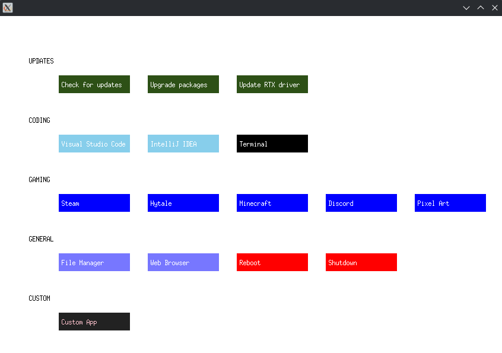

# Hub

[Latest update] 

You can now add custom colors, groups and apps, simply modify the userconfig.json! 

Feel free to delete the apps you don't need!

[Build]

You can build the hub either using the C or Assembly program:

With hub.c            : gcc hub.c -o hub -lX11 

With hub.s            : gcc hub.s -o hub -lX11

Convert C to Assembly : gcc -S hub.c -o hub.s

[Run] 

$ cd /hub_folder && ./hub

Make sure to run the hub inside the same folder as the json file!

[Example]

